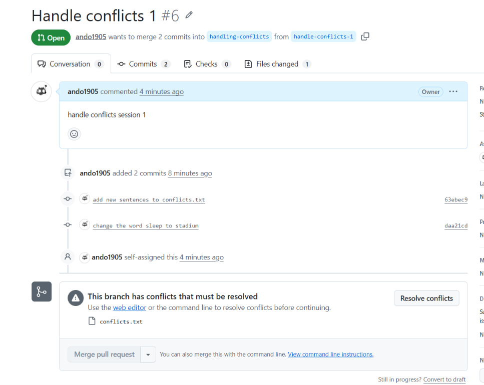

# learn-git
Learn git from the beginning

## Test section

Hello world!

## check status

`git status`

## stage changes

`git add file1 file2 ....`

Example: 

`git add README.md`

## commit changes

`git commit -m "your message"`

Example:

`git commit -m "Test commit"`

## push changes into remotes

`git push`

push a new branch in local:

`git push --set-upstream origin test-branch` to push a `test-branch` into git 

## create a new branch

`git checkout -b your-new-branch`

Example:

`git checkout -b test-branch` will create a new branch with name `test-branch` from the main branch

## checkout a branch 

`git checkout your-branch` to switch to `your-branch` locally

## logs 

`git log` to show the commit history 

## fetch new changes from git 

`git fetch` to fetch new changes from git

## pull new changes from the current branch from git 

`git pull`

## git flows 

1. create a new branch

- indicate base branch (main for example)
- checkout base branch
- fetch origin changes from git
- pull new changes for the current base branch
- create a new branch from the base branch
- make changes
- stage changes
- commit changes
- push changes
- create a pull request
- (optional) update to align with the base branch
- review changes from the pull request
- resolve review comments 
- get review approvals
- merge the current pull request

## branching approaches

there are 3 approaches:
- main branch: frequently(maybe daily) merge new code from contributors.
- milestone branch: based on release plan we create a milestone branch from the main branch and actively merge code into that milestone branch. When the milestone is ready for merging into the main branch we raise a pull request.(frequency: monthly, quaterly[happens one time for three months])
- feature branch: used for the case we have a big feature and we want colabration to develop that feature so we create a new feature branch from the main branch. Contributors will always raise a pull request into that feature branch first. When the feature is ready for merging into the main branch we raise a pull request.(frequency: weekly, fortnightly[happens one time for two weeks])

## handling conflicts 

### what are conflicts?
conflicts are events when Git can't resolve changes on your branch with changes on an origin branch that you want to merge in. 
### when will it happen?
It happens when someone makes a change on a different branch that conflicts the changes on base branch.

### how to resolve conflicts?
To resolve conflicts:
1. go to the local base branch that you want to merge into
2. Fetch and pull the changes from the origin base branch to your local base branch
3. go to the the branch that you are working on
4. merge the local base branch into the branch you are on
5. Resolve the conflicts manually by choosing or combining the changes.
6. (opitional) Make more changes
7. stage changes
8. commit the changes (don't need commit message)
9. push it to github